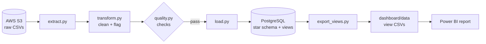
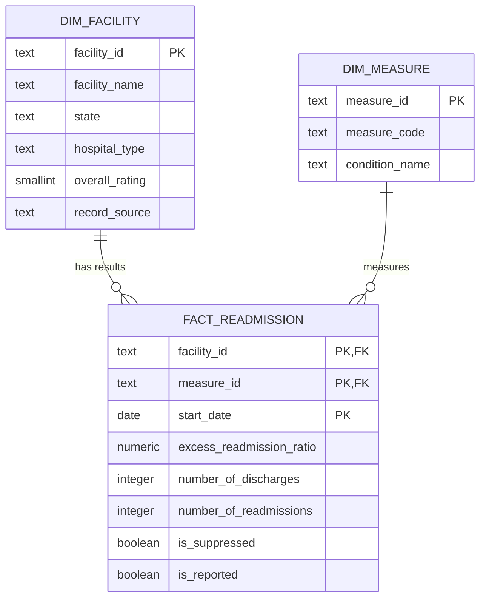
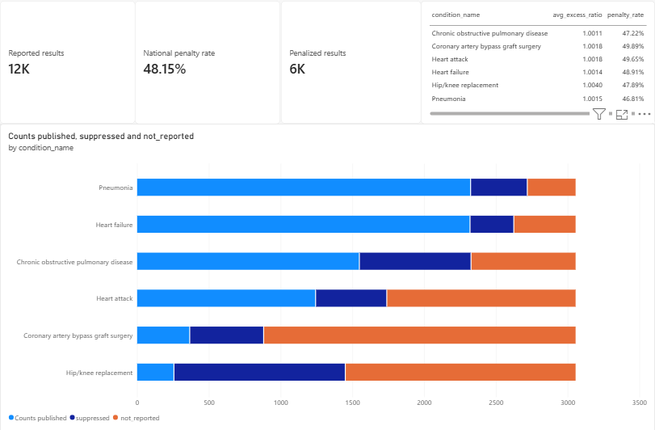
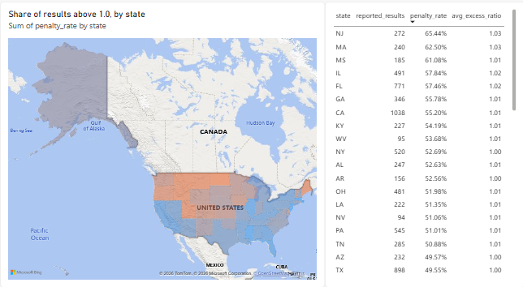
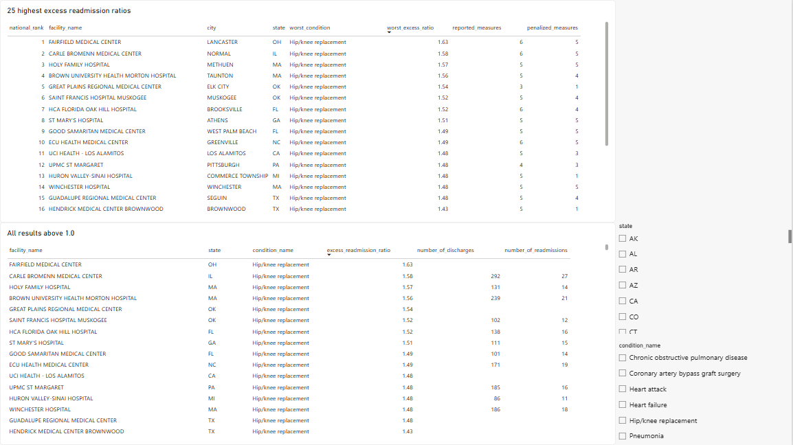

# Hospital Readmission Risk Pipeline

An end-to-end data pipeline that turns Medicare's public Hospital Readmissions Reduction Program (HRRP) data into a Power BI dashboard showing which hospitals, conditions, and states have more 30-day readmissions than expected.

**Stack:** Python (pandas) · AWS S3 · PostgreSQL (star schema + SQL views) · Power BI

## Why it matters

A readmission is when a patient returns to the hospital within 30 days of being discharged. Medicare tracks this for about 3,000 hospitals across six conditions and reduces payments by up to 3% for hospitals with more readmissions than expected. For payers, readmission patterns are a signal of care quality and a source of avoidable cost.

The key metric is the **excess readmission ratio**: a hospital's predicted readmission rate divided by the rate expected for a similar patient mix at an average hospital. Above 1.0 means more readmissions than expected.

## Architecture



Raw files are staged in S3 and kept out of git. Each step can be rerun from scratch: `load.py` rebuilds the warehouse in a single transaction, so a failure leaves the database unchanged.

## Data

| Source (CMS [Provider Data Catalog](https://data.cms.gov/provider-data/)) | Rows | One row per |
|---|---|---|
| Hospital Readmissions Reduction Program, FY2026 (performance period Jul 2021 – Jun 2024) | 18,330 | hospital × condition |
| Hospital General Information | 5,419 | hospital |

Conditions: heart attack (AMI), heart failure (HF), pneumonia (PN), COPD, coronary artery bypass graft surgery (CABG), and elective hip/knee replacement.

## Data quality

Profiling (`notebooks/01_profile.ipynb`) found these issues. `src/transform.py` and `src/load.py` handle each one:

| Issue | Impact | Handling |
|---|---|---|
| Facility IDs have leading zeros (`010001`) | Read as numbers, **0%** of IDs matched between the two files | Read as text: **99.3%** match |
| ZIP codes have leading zeros (`06105`) | 352 hospitals would get wrong ZIPs | Read as text |
| Readmission count is `"Too Few to Report"` (3,683 rows) | CMS hides counts under 11 for patient privacy; the ratio is still published | Count set to null, `is_suppressed = true` |
| No results at all in 6,610 rows (36%), footnotes 1, 5, 7 | Blank ratios and rates | Rows kept, `is_reported = false` |
| Footnote 29 rows (377) still have results | Treating "has a footnote" as "blank" would drop real data | `is_reported` is based on the ratio, not the footnote |
| `"N/A"` discharge counts | Column can't be numeric | Nullable integer |
| 20 HRRP hospitals (120 rows) missing from the hospital file | Would break the foreign key to the hospital dimension | Fallback dimension rows from the HRRP name and state, `record_source = 'hrrp_fallback'` |

`src/quality.py` runs row-count reconciliation (raw vs. processed), checks that every row is exactly one of counted / suppressed / unreported (8,037 + 3,683 + 6,610 = 18,330), and checks keys, nulls, and value ranges. It exits non-zero on any failure. Current result: 14 passed, 0 failed, 1 warning (the 20 unmatched hospitals).

## Data model

A star schema in PostgreSQL (`sql/ddl/01_tables.sql`). Key columns shown:



- **Grain:** one fact row per hospital, condition, and reporting period (18,330 rows). `start_date` is part of the key so future reporting years can be added without collisions.
- **Dimensions:** `dim_facility` (5,439 rows: 5,419 hospitals + 20 fallback rows) and `dim_measure` (6 rows).
- **No date dimension:** the data has a single reporting window, so the dates stay on the fact row.

## Dashboard views

Each view in `sql/views/` answers one dashboard question. `src/export_views.py` writes every view to `dashboard/data/<view>.csv`, which is what the Power BI report reads.

| View | Question | Rows |
|---|---|---|
| `vw_penalized_facilities` | Which hospitals have a ratio above 1.0, per condition? | 5,643 |
| `vw_state_summary` | Average ratio and penalty rate per state | 51 |
| `vw_worst_25_facilities` | The 25 hospitals with the highest ratio, ranked by their worst condition | 25 |
| `vw_national_measure_summary` | Reported vs. suppressed counts and average ratio per condition | 6 |

"Penalty rate" = results with a ratio above 1.0 ÷ reported results.

## Dashboard

The Power BI report (`dashboard/readmission_dashboard.pbix`) reads the CSVs in `dashboard/data/`, so it opens on a machine that has no database.

**National.** Totals, the average ratio and penalty rate per condition, and how much usable data each condition has. Hip/knee and bypass surgery are mostly suppressed or unreported.



**States.** Share of results above 1.0 by state, alongside result counts so thinly covered states are obvious.



**Facilities.** The 25 highest ratios nationally, and every result above 1.0, filterable by condition and state.



## Key findings

- **About half of results are above 1.0, by design.** 48.1% of the 11,720 reported results have a ratio above 1.0, and every condition averages about 1.00. The ratio is measured against the average hospital, so the signal is in the variation, not the national average.
- **States vary widely.** New Jersey (65.4%), Massachusetts (62.5%), and Mississippi (61.1%) have the highest share of results above 1.0. The lowest (North Dakota 17.1%, Montana 18.9%, Idaho 19.6%) each have fewer than 60 results. Ten states have fewer than 50, so their rates move a lot with a few hospitals.
- **Hip/knee dominates the extremes.** 23 of the 25 highest-ratio hospitals rank there because of hip/knee replacement. It has the lowest expected readmission rate (5.5%, vs. 19.3% for heart failure) and the widest spread of ratios, so small absolute differences produce large ratios.
- **Suppression limits count-based analysis.** 83% of reported hip/knee results have hidden readmission counts (12% for heart failure), so comparisons use ratios rather than counts.

## Limitations

- "Penalized" here means a ratio above 1.0. CMS's actual payment penalty compares each hospital with a peer group of hospitals that serve a similar share of dual-eligible patients, so this is a proxy.
- One three-year reporting window, so there is no trend over time.
- State averages weight every hospital-condition result equally, regardless of volume.

## How to run

Requires PostgreSQL and AWS credentials with read access to the S3 bucket. Tested with Python 3.14 and PostgreSQL 16. Without S3 access, download the two CSVs from CMS into `data/raw/` as `hrrp_fy2026.csv` and `hospital_general_info.csv` and skip `extract.py`.

```bash
python3 -m venv .venv
.venv/bin/pip install -r requirements.txt
cp .env.example .env                  # set S3_BUCKET and DATABASE_URL
createdb hrrp_warehouse

.venv/bin/python src/extract.py       # S3 -> data/raw/
.venv/bin/python src/transform.py     # clean -> data/processed/*.parquet
.venv/bin/python src/quality.py       # data quality report; exits 1 on failure
.venv/bin/python src/load.py          # rebuild star schema and views
.venv/bin/python src/export_views.py  # views -> dashboard/data/*.csv
```

## Repository structure

```
├── src/
│   ├── extract.py          # download raw CSVs from S3
│   ├── transform.py        # cleaning rules -> parquet
│   ├── quality.py          # data quality report
│   ├── load.py             # parquet -> PostgreSQL star schema
│   └── export_views.py     # SQL views -> CSVs for Power BI
├── sql/
│   ├── ddl/01_tables.sql   # star schema
│   └── views/              # one view per dashboard question
├── notebooks/
│   └── 01_profile.ipynb    # initial data profiling
├── dashboard/
│   ├── data/               # exported view CSVs (Power BI source)
│   └── readmission_dashboard.pbix
└── .env.example
```

## Next steps

- Load prior HRRP years to show trends (the fact table's key already includes the reporting period).
- Add unit tests for the transform rules.
- Schedule the pipeline and move the warehouse to a managed PostgreSQL instance.
